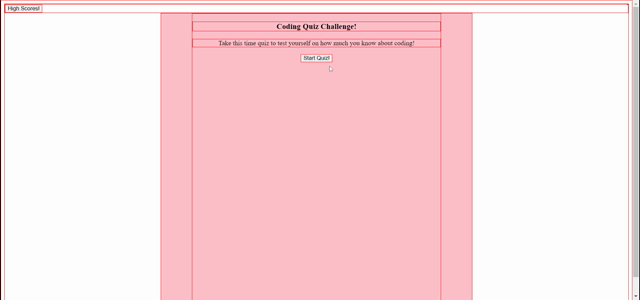

# Coding Quiz
## Ever wanted to test your coding skills? Well then this is the quiz for you! Answer a few questions about coding, but be sure to watch the clock so time doesn't run out! Save your highscores and keep quizzing yourself to beat your score!

# Description
## This website is a timed coding quiz. Here, you're able to take the quiz as well as log and keep track of your highscores. 

# Usage
## Start the quiz by clicking the "Start" button. From there, you'll be given questions and answer buttons. When a question is answered correctly, you are flashed a green screen and it moves onto the next question. When you answer a question incorrectly, you are flashed with a red screen, 5 seconds are removed from the timer (and thus your final score), and you are moved onto the next question. When you have answered all the questions, or the timer runs out, you are brought to a screen that shows you your score and asks you to put your initials in. Once you've clicked the submit button, your score is saved on the Highscores list. This Highscores list can also be accessed from the main page using the "Highscores" button.

# Video of Application

# Links
- [GitHub-Repo](https://github.com/alexiskeet/Coding-Quiz.git)
- [Live-Site](https://alexiskeet.github.io/Coding-Quiz/)

